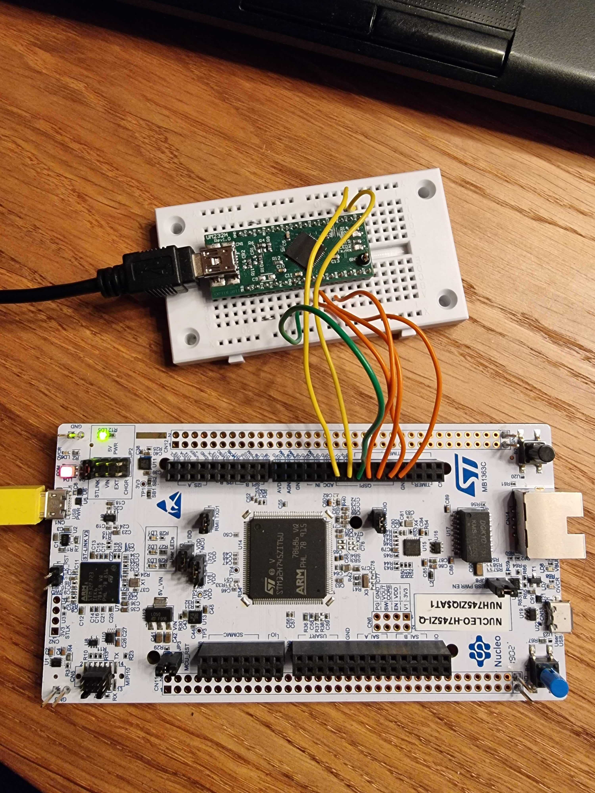

# QSpiToUSB-FT232H
Code to program a ft232h chip to act as a quad spi slave and "no HAL" example code to set up a h7 to transmit quad spi at a high rate. 

## QSpi configuration
Note that quad spi exists in a few different flavours so it is important that the ft232h and the sending chip is set up the same. The ft232h uses a protocol FTDI calls "ft1248" which can be made to work as quad spi slave but the terminology might not be the same as used in a quad spi context.

## Limitations and throughput
We have gotten speeds of around 13MByte/s, without losing data, and the limitation seems to be the rather small 1 kibibyte buffer on the ft232h that the PC host does not empty in time. To reach 13MByte/s we had to elevate the scheduling priority of the ft232h reading program on the pc side. A more realistic throughput without any special modifcations on the PC side is probably around 8MByte/s but this will probably vary between PC:s and operating systems.  

## Image of setup:

